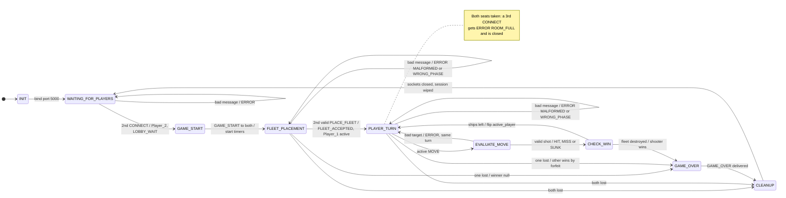

# Battleship Server State Machine (FSM) Specification

**Course:** CS 457
**Written by:** Landon Holland

---

## 1. Overview

This is the server's game state machine. The server runs one game at a time on a single-threaded event loop, and the current state is one variable in the session. All messages, error codes, and game-end cases named here are defined in [`protocol_blueprint.md`](protocol_blueprint.md).

States are either **waiting** or **transient**:

- **Waiting states** (`WAITING_FOR_PLAYERS`, `FLEET_PLACEMENT`, `PLAYER_TURN`, `GAME_OVER`) sit in the event loop until a socket event or a timer moves them.
- **Transient states** (`INIT`, `GAME_START`, `EVALUATE_MOVE`, `CHECK_WIN`, `CLEANUP`) do their work and leave within the same event-loop step. They never read from a socket, so a lost connection is only ever noticed in a waiting state.

Two changes from the example FSM in the assignment:

- **`FLEET_PLACEMENT` is added.** Battleship has a setup phase before any shot is fired.
- **`CHECK_WIN` replaces `CHECK_WIN_DRAW`.** A draw is impossible: players fire one shot at a time and the win check runs after every shot, so both fleets can never reach zero on the same turn.

---

## 2. State Diagram

Each arrow is labeled `trigger / action`. The labels are kept short so the diagram stays readable. The full behavior of each state is in #4, and every failure path is in #5.

| Label | Meaning |
| ----- | ------- |
| `1st CONNECT`, `2nd CONNECT` | A `CONNECT` that passes every check, from the 1st or 2nd client to join. It assigns `Player_1` or `Player_2` |
| `bad message` | A message the server rejects without a state change: `MALFORMED` (bad JSON, a wrong-type field, a `player_id` that does not match the socket), `WRONG_PHASE` (not allowed in this state), or, in the lobby, `VERSION_MISMATCH` |
| `start timers` | Start each player's 500 s placement timer |
| `active MOVE`, `inactive MOVE` | A `MOVE` from the player who is or is not `active_player` |
| `bad target` | A shot off the board (`INVALID_COORD`) or at a cell already fired at (`ALREADY_FIRED`) |
| `ships left`, `fleet destroyed` | The defender does or does not still have unhit ship cells |
| `one lost`, `both lost` | One or both seated players were lost, as defined in #3 |

**Mermaid link:** [Open my diagram in the Mermaid Live Editor](https://mermaid.live/edit#pako:eNqdlm1v2jAQx7_KyS8n6Hgu5cWklLorWiAohFXbmCKXGIgaYuSYbl3V775zHiCEQLfyKr7c_c7-3_nIC5kLj5MeiRRT_MZnS8nW1afGTM5CwJ_nSz5XvgjBtLUts8fuMCOD0cCZEWARxE-Ft_fGwBmMPru3lu2OTeMbtSeJc9mLQuxnY0jdiWPYKT-3LnjempQ6GtOnQzpK3YvGQkyS1HWm9ijxzxsKvvSrYU4Nh7pD6ytNvA9NBf_-He1_ce8HKXm_LDshxtu5A8bLIs-kxmg6TmnpIleLHx9-QrX66aAC-jk2ligNPXjwQw82Qipo12q1PKzM_zSnHinoW6MR7TvwEcYBe-bSrVfAtK6vv7k65n3cjASBwAwfYSE5hygQ6n24B-bBmkcRW3KEUdu27LdA-3bD-AaqdXTMRvGYGTIXqkmFTkRczkEJeBBqhVSsNpZD-WsuozytGF6O1IV4YoHvQWx1Yw-kJp5Gv0_HDr35P6YflhFj9bC_8AYMbo4v2L-hSwoCQ8PEIgzpDQgJ97aFRRnfGRN6jpy7tWmZ3hahsu8uhqPtiZ9LsLuUiBchz_rxlx-GXEK4DYJz0ell1QfWRdbB-dLmd398Gj9Mtgd6xuxUsqaOa90ezKnzmPdIXSQejDtk5jZ2KuSEcCgD6obyRfDwDAshF9xXpxhvyHe4q_KT46VacpUdvAIRW3NQW3kGspvXiEi6KVoJjbgbOBUYDiYTrdpkOvqS38w-6ngj0crfRBDwRTzKAn-TCuhu4kYsR-QFXAQcD-HxSEnxzD09LVZCqFTJo9kTRx0KuLd7PMDUknu7tKnT6fEZifkjVxHMsQLcQxGxnfQnwS9_k2AyVIh7AukvVwrEouwvVf-udS0jzhCo2CMPsZ2gKXcDNu-61FmTlrUta-jeTk0TGN5yP9tM5s3RqLOTCllK3yM9Jbe8QnCYrplekhftNyPYfms-Iz18RAm2v6sek4_VuQiEnJFZ-IrxGxZ-F2KdIaTYLlekt2BBhKvtxtt_J-1cMDuXfbENFenVO1cxg_ReyG_Sq9Zrze7FZbPdbV51W83LdoU8a2v9otPptjv1q2a71Wh1a-3XCvkTp21ctGr1WqdVb9baOu7y9S95Tdyh) (Way easier to see the whole state diagram this way)

---

## 3. "Player Lost"

A seated player is "lost" when any of these event happen. The FSM doesn't care which of the six it was. For simplicity, all of them lead to the same transitions. This is shown in the second table. These are the same six events as rows 2 to 7 of the game end table in [#5 of the protocol blueprint](protocol_blueprint.md#5-game-end-and-cleanup). This will hopefully cover any events where the player disconnects either intentionally or unintentionally.

| Trigger | How the server notices it |
| ------- | ------------------------- |
| Graceful quit | A `DISCONNECT` message arrives, then the client closes (TCP FIN) |
| Clean close | `recv()` returns `b""` (EOF) |
| Unexpected drop | `ConnectionResetError`, `BrokenPipeError`, or `ConnectionAbortedError` on a read or write |
| Timeout | The player's placement or turn timer reaches 500 s (blueprint #5, Timeouts) |
| Oversized frame | More than 64 KB arrives without a newline. The server sends `ERROR` (`FRAME_TOO_LARGE`), then closes (this is subject to change in the future to be handlded better)|
| Send buffer overflow | More than 64 KB of messages for this player is waiting to be sent because the client is not reading them. Closed with no message (blueprint #5, Send Buffer Limit) |

Where it happens will dictate what happens next:

| State | One player lost | Both players lost |
| ----- | --------------- | ----------------- |
| `WAITING_FOR_PLAYERS` | Not a game end. Wipe `Player_1`, free the slot, keep waiting | Not possible (only one seat can be filled) |
| `FLEET_PLACEMENT` | `GAME_OVER` to the other player, `winner: null` | Straight to `CLEANUP`, nothing sent |
| `PLAYER_TURN` | `GAME_OVER` to the other player, who wins by forfeit | Straight to `CLEANUP`, nothing sent |
| `GAME_OVER` | Close that socket. Nothing else changes | Close both. `GAME_OVER` moves on to `CLEANUP` |

"Both players lost" in the table means both are noticed in the same event-loop step, Ex: both placement timers expiring together. If the second player is lost a moment later, the server is already in `GAME_OVER`, and the last row applies. not sure how often this will happen accidentally, most games will end in a `GAME_OVER`.

---

## 4. State Table

| State | Type | Entered when | Server behavior | Exits to |
| ----- | ---- | ------------ | --------------- | -------- |
| `INIT` | transient | The server process starts | Bind the listening socket on port 5000, register it with the selector, create an empty session | `WAITING_FOR_PLAYERS` |
| `WAITING_FOR_PLAYERS` | waiting | After `INIT`, or after `CLEANUP` | Accept connections. On a valid `CONNECT`, assign the next ID in join order (`Player_1`, then `Player_2`) and reply `LOBBY_WAIT`. If `Player_1` is lost, wipe the ID and free the slot. No timer runs here | `GAME_START` once `Player_2` is assigned |
| `GAME_START` | transient | The 2nd valid `CONNECT` is accepted | Send each player `GAME_START` (opponent name, board size, fleet). Start a 500 s placement timer for each player | `FLEET_PLACEMENT` |
| `FLEET_PLACEMENT` | waiting | `GAME_START` was sent | Validate each `PLACE_FLEET`. Store a valid layout, stop that player's timer, and reply `FLEET_ACCEPTED` (`opponent_ready: false` for the 1st layout, `true` for the 2nd). Reject an invalid one with `INVALID_PLACEMENT` (the timer keeps running). A `MOVE` or a 2nd `PLACE_FLEET` gets `WRONG_PHASE` | `PLAYER_TURN` once both layouts are stored, with `active_player` set to `Player_1`, a `STATE_UPDATE` to each player, and the turn timer started. `GAME_OVER` or `CLEANUP` if players are lost (#3) |
| `PLAYER_TURN` | waiting | Both fleets stored, or `CHECK_WIN` found ships left, or `EVALUATE_MOVE` rejected a shot | Wait for a `MOVE` from `active_player`, whose turn timer is running. A `MOVE` from the other player gets `OUT_OF_TURN` | `EVALUATE_MOVE` on a `MOVE` from the active player. `GAME_OVER` or `CLEANUP` if players are lost (#3) |
| `EVALUATE_MOVE` | transient | The active player's `MOVE` passed the shape checks | Check that the cell is on the board (`INVALID_COORD`) and not already fired at by this player (`ALREADY_FIRED`). For a valid shot, stop the turn timer, resolve it as `HIT`, `MISS`, or `SUNK`, and mark it on the defender's board and the shooter's tracking grid | `CHECK_WIN` on a valid shot. `PLAYER_TURN` on a rejected one: same active player, timer still running |
| `CHECK_WIN` | transient | A valid shot was resolved | Count the defender's unhit ship cells | `GAME_OVER` if none are left (`winner` is the shooter, reason `FLEET_DESTROYED`). Otherwise flip `active_player`, send each player a `STATE_UPDATE`, start a new turn timer, and return to `PLAYER_TURN` |
| `GAME_OVER` | waiting | The defender's fleet was destroyed, or one player was lost | Send each reachable player `GAME_OVER` with their own view. Stop reading from both sockets and discard anything that arrives. Close each socket once its send buffer is empty | `CLEANUP` once both sockets are closed |
| `CLEANUP` | transient | `GAME_OVER` was delivered, or both players were lost | Close and unregister any player socket still open. Discard the session: boards, fleets, both IDs, `active_player`, shot counts, timers. The listening socket stays open | `WAITING_FOR_PLAYERS` for the next game |

---

## 5. Edge Cases and Failure Paths

Every `ERROR` goes only to the client that caused it. A rejected message is fully handled inside one event-loop step: the handler sends the `ERROR`, changes no game state, and returns, so the loop keeps running and the other player is not affected.

| Case | Where | Server response | State after |
| ---- | ----- | --------------- | ----------- |
| `MOVE` out of turn | `PLAYER_TURN` | `ERROR` (`OUT_OF_TURN`) | `PLAYER_TURN`, unchanged. The active player's timer keeps running |
| Shot off the board | `EVALUATE_MOVE` | `ERROR` (`INVALID_COORD`) | `PLAYER_TURN`, same player's turn. The turn is not used up |
| Shot at a cell already fired at | `EVALUATE_MOVE` | `ERROR` (`ALREADY_FIRED`) | `PLAYER_TURN`, same player's turn. The turn is not used up |
| Invalid fleet layout | `FLEET_PLACEMENT` | `ERROR` (`INVALID_PLACEMENT`) | `FLEET_PLACEMENT`. The player can send a corrected layout |
| Malformed message: bad JSON, a missing or wrong-type field (including a boolean where an integer belongs), a `player_id` that does not match the socket, an unknown or server-only `msg_type` | Any state | `ERROR` (`MALFORMED`) | Unchanged |
| Message not allowed right now, e.g. `MOVE` during placement, a 2nd `PLACE_FLEET`, a 2nd `CONNECT` on one connection | Any state | `ERROR` (`WRONG_PHASE`) | Unchanged |
| Unsupported protocol version | Any state | `ERROR` (`VERSION_MISMATCH`), then that client is closed | Unchanged. The client never had a seat |
| 3rd client while both seats are taken | `FLEET_PLACEMENT`, `PLAYER_TURN`, `GAME_OVER` | `ERROR` (`ROOM_FULL`), then that client is closed | Unchanged. The client never had a seat |
| Player lost in the lobby | `WAITING_FOR_PLAYERS` | Nothing sent. ID wiped, slot freed | `WAITING_FOR_PLAYERS` |
| Player lost during placement | `FLEET_PLACEMENT` | Other player gets `GAME_OVER` (`OPPONENT_DISCONNECTED`, `winner: null`) | `GAME_OVER`, then `CLEANUP` |
| Player lost during turns | `PLAYER_TURN` | Other player gets `GAME_OVER` (`OPPONENT_DISCONNECTED`) and wins by forfeit | `GAME_OVER`, then `CLEANUP` |
| Silent drop (cut link, power loss: no FIN or RST) | `FLEET_PLACEMENT`, `PLAYER_TURN` | Caught by the 500 s timer, then handled as a lost player | As the two rows above |
| Client floods messages and never reads the replies | Any state | Once more than 64 KB is waiting to be sent to it, the client is closed and handled as a lost player | As the three "player lost" rows above |
| Both players lost | `FLEET_PLACEMENT`, `PLAYER_TURN` | Nothing sent | `CLEANUP` |
| Post-game reset | `CLEANUP` | Both player sockets closed, session discarded | `WAITING_FOR_PLAYERS`. Two new `CONNECT`s start the next round |

---

## 6. Turn Enforcement

The session holds one `active_player` field, and only the server reads or writes it.

1. **Who sent it.** Before any game rule is checked, the server compares the message's `player_id` with the ID it assigned to the socket the message arrived on. A mismatch is `MALFORMED`, so a client cannot act as its opponent by copying the other player's ID.
2. **Whose turn it is.** In `PLAYER_TURN`, a `MOVE` whose sender is not `active_player` gets `OUT_OF_TURN` and changes nothing.
3. **When the turn changes.** `active_player` is flipped only in `CHECK_WIN`, after a valid shot that did not end the game. A rejected shot never flips it, so a mistyped coordinate does not cost the player their turn.
4. **How clients learn it.** Every `STATE_UPDATE` carries `active_player`. A client only prompts for a shot when that field names it, but that is for usability. The enforcement is entirely on the server, so a modified client still cannot fire out of turn.
5. **How long a turn can last.** Only `active_player` has a running turn timer. If it reaches 500 s without a valid `MOVE`, that player is lost (#3) and the opponent wins by forfeit.
