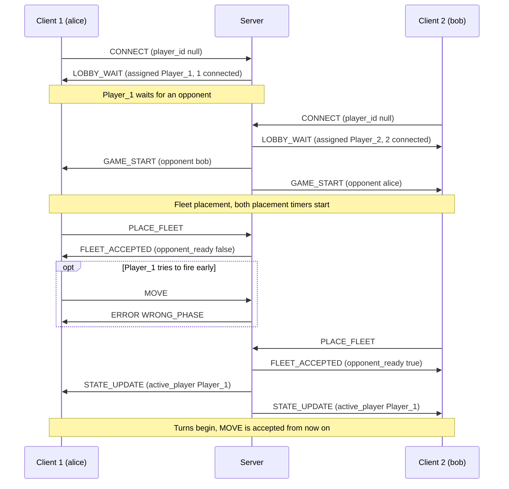

# Battleship Application Protocol Blueprint

**Course:** CS 457
**Written by:** Landon Holland

---

## 1. Message Envelope

Every message in both directions is a JSON object that uses the same 4 field envelope. Only the contents of `payload` change between message types.

| Field       | Type           | Required | Description                                                                                                                     |
| ----------- | -------------- | -------- | ------------------------------------------------------------------------------------------------------------------------------- |
| `msg_type`  | string         | yes      | The message type, one of the types defined in this document (`CONNECT`, `MOVE`, `STATE_UPDATE`)                            |
| `player_id` | string or null | yes      | The sender's ID. Clients send `Player_1` or `Player_2` once assigned, or `null` before assignment. The server always sends `"SERVER"` |
| `payload`   | object         | yes      | Fields specific to `msg_type`. May be an empty object `{}`                                                                      |
| `timestamp` | integer        | yes      | Unix time in seconds when the message was sent                                                                                  |

Unknown fields are ignored by the receiver so that hopefully the schema can grow in later sprints without breaking an older client.

**Integer fields:** every field typed "integer" in this document (`timestamp`, `row`, `col`, and the rest) must be a JSON number with no fraction or exponent, such as `6`. Anything else is the wrong type and is rejected with `ERROR` (`MALFORMED`):

- **Booleans are not integers.** `true` and `false` are rejected. This needs an explicit check in Python, where `bool` is a subclass of `int`: `isinstance(True, int)` is `True`, so `{"row": true}` would pass as row `1`. The validator checks `type(value) is int` instead.
- **Floats are not integers.** `6.0` is rejected even though it equals `6`, because `json.loads` turns it into a `float`.
- **Strings are not integers.** `"6"` is rejected because the server will not convert it.

### Player ID Assignment

- A client has no ID when it connects, so `player_id` is `null` on its 1st `CONNECT`.
- The server stores the current player IDs and assigns one to the client in its `LOBBY_WAIT` reply. The 1st client to connect is `Player_1` and the 2nd is `Player_2`. The client uses the assigned ID in every message after that.
- An ID belongs to one connection for one game. It is wiped when that player disconnects, or when the game ends and the server closes both connections (see #5), so ID assignment is done again for every game.
- A game cannot start until both players have been assigned an ID.

### Player ID Validation

The server checks `player_id` on all client messages before acting on it:

- `null` is only allowed on `CONNECT`. Any other message with a `null` `player_id` is rejected with `ERROR` (`MALFORMED`).
- The server knows what ID it assigned to what socket. A message whose `player_id` does not match the ID assigned to the socket it arrived on is rejected with `ERROR` (`MALFORMED`), so a client (hopefully) cannot act as its opponent by copying the other player's ID.
- A rejected message changes no game state, and the `ERROR` goes only to the client that sent it.

---

## 2. Message Types

### `CONNECT`

- **Direction:** Client -> Server
- **Purpose:** The client asks to join the game room. This is the 1st message a client sends, and the only message allowed to have a `null` `player_id`.

**Payload:**

| Field          | Type   | Required | Description                                         |
| -------------- | ------ | -------- | --------------------------------------------------- |
| `display_name` | string | yes      | The name shown to the opponent. It will be bound to 1 to 20 characters, only `a` to `z` (lowercase English letters, no spaces). Anything else -> `MALFORMED`                      |
| `version`      | string | yes      | The protocol version the client speaks, Ex: `"0.0"` |

**Server handling:**

1. If `player_id` is not `null`, reply `ERROR` (`MALFORMED`).
2. If this socket already has an assigned ID (like a second `CONNECT` on the same connection), reply `ERROR` (`WRONG_PHASE`). A client sends `CONNECT` once per connection.
3. If `version` is not a version the server speaks, reply `ERROR` (`VERSION_MISMATCH`) and close the connection.
4. If the room has an open slot, assign the next ID in join order (`Player_1`, then `Player_2`), store the display name, and reply with `LOBBY_WAIT`.
5. Once both IDs are assigned, send `GAME_START` to both players.
6. If both slots are already taken, reply `ERROR` (`ROOM_FULL`), do not assign an ID, and close the connection.

```json
{
  "msg_type": "CONNECT",
  "player_id": null,
  "payload": {
    "display_name": "placeholder",
    "version": "0.0"
  },
  "timestamp": 1727000000
}
```

### `LOBBY_WAIT`

- **Direction:** Server -> Client
- **Purpose:** The server's reply to a successful `CONNECT`. It gives the client its `player_id` for the current game and reports how many players are in the room. Both client gets their ID this way.

**Payload:**

| Field               | Type    | Required | Description                                                       |
| ------------------- | ------- | -------- | ----------------------------------------------------------------- |
| `assigned_id`       | string  | yes      | `Player_1` or `Player_2` for now. The client uses this ID from now on     |
| `players_connected` | integer | yes      | `1` or `2`. The number of players in the room, including this one |

The assigned ID goes in the payload because the envelope's `player_id` on server messages is always `"SERVER"`.

**Client handling:**

1. Store `assigned_id` and use it as `player_id` in every message after this.
2. If `players_connected` is `1`, show that it is waiting for an opponent.
3. If `players_connected` is `2`, `GAME_START` follows immediately.

```json
{
  "msg_type": "LOBBY_WAIT",
  "player_id": "SERVER",
  "payload": {
    "assigned_id": "Player_1",
    "players_connected": 1
  },
  "timestamp": 1727000001
}
```

### `GAME_START`

- **Direction:** Server -> both clients
- **Purpose:** Both players have IDs, so the game starts. Sent to each client right after the second players `LOBBY_WAIT`. It tells each client who it is playing and the rules for this game, and moves both clients into fleet placement.

**Payload:**

| Field           | Type             | Required | Description                                                       |
| --------------- | ---------------- | -------- | ----------------------------------------------------------------- |
| `opponent_name` | string           | yes      | The opponent's `display_name` from their `CONNECT`                |
| `board_size`    | integer          | yes      | Width and height of the square grid. `10` for a 10x10 board       |
| `fleet`         | array of objects | yes      | The ships each player must place. Each object has `name` (string) and `length` (integer) |

The client hardcodes zero game rules. It draws the board and builds its placement prompts from `board_size` and `fleet`, so the server will hopefully be the only source of truth for the rules.

**Client handling:**

1. Store `opponent_name`, `board_size`, and `fleet`.
2. Enter fleet placement and prompt the player to place every ship in `fleet`.
3. Send the layout to the server in `PLACE_FLEET`.

```json
{
  "msg_type": "GAME_START",
  "player_id": "SERVER",
  "payload": {
    "opponent_name": "placeholder",
    "board_size": 10,
    "fleet": [
      { "name": "Carrier",    "length": 5 },
      { "name": "Battleship", "length": 4 },
      { "name": "Cruiser",    "length": 3 },
      { "name": "Submarine",  "length": 3 },
      { "name": "Destroyer",  "length": 2 }
    ]
  },
  "timestamp": 1727000002
}
```

### `PLACE_FLEET`

- **Direction:** Client -> Server
- **Purpose:** The client submits its whole fleet layout at once, one entry per ship listed in `GAME_START`.

**Payload:**

| Field   | Type             | Required | Description                                      |
| ------- | ---------------- | -------- | ------------------------------------------------ |
| `ships` | array of objects | yes      | One object per ship in the fleet, described below |

Each object in `ships`:

| Field         | Type    | Required | Description                                                                 |
| ------------- | ------- | -------- | --------------------------------------------------------------------------- |
| `name`        | string  | yes      | Ship name, matching a `name` from the `GAME_START` fleet                     |
| `row`         | integer | yes      | Row of the ship's starting cell, `0` to `board_size - 1`                     |
| `col`         | integer | yes      | Column of the ship's starting cell, `0` to `board_size - 1`                  |
| `orientation` | string  | yes      | `"H"`: the ship runs right from the start cell. `"V"`: it runs down from the start cell |

The client does not send a ship's length. The server looks it up from the fleet by `name`, so a client cannot change a ship's size.

**Server handling:**

1. Validate the layout:
   - every ship in the fleet appears only once, and no other names appear
   - `orientation` is `"H"` or `"V"`
   - every cell of every ship is on the board
   - no 2 ships share a cell
2. If any check fails, reply `ERROR` (`INVALID_PLACEMENT`). The player stays in fleet placement and can send a corrected `PLACE_FLEET`.
3. If the layout is valid, store it, stop that player's placement timer, and reply `FLEET_ACCEPTED` (see below).
4. A layout is final once accepted. Another `PLACE_FLEET` from a player whose valid layout is already stored is rejected with `ERROR` (`WRONG_PHASE`).
5. Once both players have a valid layout (the 2nd `FLEET_ACCEPTED` has `opponent_ready: true`), the game moves to turns with `Player_1` as the active player, and the server sends each player a `STATE_UPDATE`.

```json
{
  "msg_type": "PLACE_FLEET",
  "player_id": "Player_1",
  "payload": {
    "ships": [
      { "name": "Carrier",    "row": 0, "col": 0, "orientation": "H" },
      { "name": "Battleship", "row": 2, "col": 3, "orientation": "V" },
      { "name": "Cruiser",    "row": 6, "col": 5, "orientation": "H" },
      { "name": "Submarine",  "row": 7, "col": 1, "orientation": "V" },
      { "name": "Destroyer",  "row": 9, "col": 8, "orientation": "H" }
    ]
  },
  "timestamp": 1727000010
}
```

### `FLEET_ACCEPTED`

- **Direction:** Server -> Client
- **Purpose:** The server's reply to a valid `PLACE_FLEET`. It confirms that the layout passed every check and is now stored, so the client knows its fleet is final and no `ERROR` is coming for it. Without it, the client could not tell "accepted" apart from "not checked yet". It is sent only to the player whose layout was accepted.

**Payload:**

| Field            | Type    | Required | Description |
| ---------------- | ------- | -------- | ----------- |
| `opponent_ready` | boolean | yes      | `false`: the opponent has no accepted layout yet, so this player waits. `true`: this was the 2nd layout accepted, so turns begin now |

The accepted layout is not sent back. The client already knows what it sent, and the first `STATE_UPDATE` shows the board as the server stored it.

**When it is sent:**

- **1st player to place:** gets `FLEET_ACCEPTED` with `opponent_ready: false`, then no further game messages until the opponent's layout is accepted (or the game ends early, see #5).
- **2nd player to place:** gets `FLEET_ACCEPTED` with `opponent_ready: true`. In the same event-loop step, the server sends each player its first `STATE_UPDATE`. So the 2nd player receives `FLEET_ACCEPTED` and then `STATE_UPDATE` right after it, and the 1st player receives only the `STATE_UPDATE`.

`FLEET_ACCEPTED` is always queued before that `STATE_UPDATE` on the same connection, and TCP keeps bytes in order, so a client never sees the `STATE_UPDATE` first.

**Client handling:**

1. Stop the placement prompt. The fleet is final, and another `PLACE_FLEET` would get `ERROR` (`WRONG_PHASE`).
2. If `opponent_ready` is `false`, show that it is waiting for the opponent to place their fleet.
3. If `opponent_ready` is `true`, show that the game is starting. The first `STATE_UPDATE` follows immediately.

The example below is the reply to `Player_1`'s `PLACE_FLEET` above, sent before `Player_2` has placed:

```json
{
  "msg_type": "FLEET_ACCEPTED",
  "player_id": "SERVER",
  "payload": {
    "opponent_ready": false
  },
  "timestamp": 1727000010
}
```

### `MOVE`

- **Direction:** Client -> Server
- **Purpose:** The active player fires one shot at a cell on the opponent's grid.

**Payload:**

| Field | Type    | Required | Description                                  |
| ----- | ------- | -------- | -------------------------------------------- |
| `row` | integer | yes      | Target row, `0` to `board_size - 1`          |
| `col` | integer | yes      | Target column, `0` to `board_size - 1`       |

The player types a coordinate like `B7`. As in standard Battleship, the letter is the row and the number is the column. The client will convert it to zero based integers before sending, so the server only ever sees `row` and `col`:

- **Row:** the letter, `A` to `J`, becomes `0` to `9`
- **Column:** the number, `1` to `10`, becomes `0` to `9`

Ex: `B7` becomes `row: 1, col: 6`, like in the sample below.

**Server handling:**

The checks run in this order. The 1st one that fails chooses what error the player will see.

1. If the game is not in turns (for example, during fleet placement), reply `ERROR` (`WRONG_PHASE`).
2. If the sender is not the active player, reply `ERROR` (`OUT_OF_TURN`).
3. If `row` or `col` is off the board, reply `ERROR` (`INVALID_COORD`). A missing or non-integer `row` or `col` never reaches this step: it is rejected earlier as `MALFORMED` (see Error Codes).
4. If this player has already fired at that cell, reply `ERROR` (`ALREADY_FIRED`).
5. Otherwise the shot is valid:
   - resolve it against the opponent's fleet as `HIT`, `MISS`, or `SUNK`
   - check whether the opponent has any ship cells left
   - if they have none, send `GAME_OVER` with reason `FLEET_DESTROYED`
   - if they still have ships, switch the active player and send each player a `STATE_UPDATE`

A rejected `MOVE` changes no game state and does not use up the turn, so the player can try again. The `ERROR` goes only to the sender.

```json
{
  "msg_type": "MOVE",
  "player_id": "Player_1",
  "payload": {
    "row": 1,
    "col": 6
  },
  "timestamp": 1727000020
}
```

### `STATE_UPDATE`

- **Direction:** Server -> each client
- **Purpose:** Tells a player the current state of the game. The server builds a separate view for each player and sends it only to that player. It is never broadcast identically, and a player never receives the opponent's ship positions.
- **When it is sent:** once when turns begin (after both fleets are placed), and after every valid shot that does not end the game. A shot that ends the game gets `GAME_OVER` instead.

There is no `phase` field. The message type already tells the client which phase it is in: `GAME_START` means fleet placement, `FLEET_ACCEPTED` means this player's fleet is placed and final, `STATE_UPDATE` means turns, and `GAME_OVER` means the game is over.

**Payload:**

| Field             | Type                | Required | Description                                                                                   |
| ----------------- | ------------------- | -------- | --------------------------------------------------------------------------------------------- |
| `active_player`   | string              | yes      | The player whose turn it is now. The client only prompts for a shot when this is its own ID     |
| `your_board`      | array of strings    | yes      | The receiving player's own board: their ships and the opponent's shots. One string per row     |
| `tracking_grid`   | array of strings    | yes      | The receiving player's shots at the opponent: hits and misses only. One string per row         |
| `last_shot`       | object or null      | yes      | The most recent shot, described below. `null` on the first update, before any shot is fired   |
| `ships_remaining` | object              | yes      | Ships still afloat for each player, keyed by player ID, Ex: `{"Player_1": 5, "Player_2": 4}`  |
| `shots_fired`     | integer             | yes      | Total valid shots fired by both players this game. `0` on the first update, then `+1` per valid shot. Rejected moves are not counted |

Each `last_shot` object:

| Field       | Type           | Required | Description                                               |
| ----------- | -------------- | -------- | --------------------------------------------------------- |
| `shooter`   | string         | yes      | ID of the player who fired                                |
| `row`       | integer        | yes      | Target row                                                |
| `col`       | integer        | yes      | Target column                                             |
| `result`    | string         | yes      | `"HIT"`, `"MISS"`, or `"SUNK"`                            |
| `ship_sunk` | string or null | yes      | Name of the ship that was sunk when `result` is `"SUNK"`, otherwise `null` |

**Client handling:**

1. Redraw both grids from `your_board` and `tracking_grid`. The client keeps no board state of its own.
2. Show the result of `last_shot`, if there is one.
3. If `active_player` is this client's ID, prompt for a shot. Otherwise show that it is waiting for the opponent.

The example below is `Player_1`'s view after five shots, using the `PLACE_FLEET` layout above:

1. `Player_1` fires at D6 (3,5): miss
2. `Player_2` fires at E4 (4,3): hits the Battleship
3. `Player_1` fires at I9 (8,8): miss
4. `Player_2` fires at F10 (5,9): miss
5. `Player_1` fires at B7 (1,6): hit

```json
{
  "msg_type": "STATE_UPDATE",
  "player_id": "SERVER",
  "payload": {
    "active_player": "Player_2",
    "your_board": [
      "SSSSS.....",
      "..........",
      "...S......",
      "...S......",
      "...X......",
      "...S.....O",
      ".....SSS..",
      ".S........",
      ".S........",
      ".S......SS"
    ],
    "tracking_grid": [
      "..........",
      "......X...",
      "..........",
      ".....O....",
      "..........",
      "..........",
      "..........",
      "..........",
      "........O.",
      ".........."
    ],
    "last_shot": {
      "shooter": "Player_1",
      "row": 1,
      "col": 6,
      "result": "HIT",
      "ship_sunk": null
    },
    "ships_remaining": { "Player_1": 5, "Player_2": 5 },
    "shots_fired": 5
  },
  "timestamp": 1727000030
}
```

### `ERROR`

- **Direction:** Server -> Client
- **Purpose:** The server rejects a client message. It is sent only to the client whose message was rejected.

**Payload:**

| Field     | Type   | Required | Description                                                                     |
| --------- | ------ | -------- | ------------------------------------------------------------------------------- |
| `code`    | string | yes      | Machine readable reason. The client decides what to do based on this field |
| `message` | string | yes      | Human readable explanation the client can show to the player                     |
| `rejected_type` | string or null | yes | The `msg_type` of the message being rejected, so the client knows which of its messages failed. `null` when the server cannot name it: the message was not valid JSON, had no string `msg_type`, had a `msg_type` that is not a client message type, or was never a complete frame (`FRAME_TOO_LARGE`) |

`rejected_type` only ever holds one of the four client message types (`CONNECT`, `PLACE_FLEET`, `MOVE`, `DISCONNECT`) or `null`. The server never echoes back an unknown string from the client.

**Server handling:**

- A rejected message does not change game state. The server keeps the connection open and stays in the same state, so the client can correct the problem and try again.
- A rejected `MOVE` does not use up the player's turn.
- Exceptions: after `ROOM_FULL`, `VERSION_MISMATCH`, or `FRAME_TOO_LARGE`, the server sends the `ERROR` and then closes the connection, since retrying cannot help. What this means for the opponent:
  - `ROOM_FULL` and `VERSION_MISMATCH` are only ever sent to a client with no seat (a seated client's `CONNECT` is rejected earlier with `WRONG_PHASE`), so a game in progress is not affected and the players get nothing.
  - `FRAME_TOO_LARGE` can hit a seated player. Closing that player ends the game like any other disconnect: the opponent gets `GAME_OVER` (`OPPONENT_DISCONNECTED`), then both connections are closed and the server runs `CLEANUP` (#5, row 6).

**Client handling:**

1. Show `message` to the player.
2. Use `code` and `rejected_type` to decide what to do next, Ex: re prompt for a shot after a `MOVE` gets `INVALID_COORD` or `ALREADY_FIRED`, or go back to the placement prompt after a `PLACE_FLEET` gets `INVALID_PLACEMENT` or `MALFORMED`.

```json
{
  "msg_type": "ERROR",
  "player_id": "SERVER",
  "payload": {
    "code": "OUT_OF_TURN",
    "message": "It is not your turn. Waiting for Player_2.",
    "rejected_type": "MOVE"
  },
  "timestamp": 1727000031
}
```

### `GAME_OVER`

- **Direction:** Server -> each connected client
- **Purpose:** The game has ended. Tells each player the result, the final stats, and both final boards. This is the last message of a game and the last message on the connection: the server closes the socket right after sending it (see #5).
- **Who gets it:** on a normal win, both players, each with their own view (like `STATE_UPDATE`). On a disconnect or timeout, only the remaining player.

**Payload:**

| Field            | Type                     | Required | Description                                                                                       |
| ---------------- | ------------------------ | -------- | ------------------------------------------------------------------------------------------------- |
| `winner`         | string or null           | yes      | ID of the winning player. `null` when a player disconnects during fleet placement                 |
| `reason`         | string                   | yes      | `"FLEET_DESTROYED"` or `"OPPONENT_DISCONNECTED"`                                                  |
| `stats`          | object                   | yes      | stats per player keyed by player ID                       |
| `your_board`     | array of strings         | yes      | The receiving player's final board (see Board Encoding)                                               |
| `opponent_board` | array of strings or null | yes      | The opponent's final board with every ship revealed. `null` when the game ended during fleet placement |

Each entry in `stats`:

| Field   | Type    | Required | Description                         |
| ------- | ------- | -------- | ----------------------------------- |
| `shots` | integer | yes      | Valid shots this player fired       |
| `hits`  | integer | yes      | How many of those shots were hits   |

There is no accuracy field. The client computes it as `hits / shots` if it wants to show it, so the payload only carries integers. The per-player counts sit inside `stats` so they are not confused with the game-wide `shots_fired` in `STATE_UPDATE`.

**Ending during fleet placement:** no shots have been fired, so `winner` is `null`, every `shots` and `hits` is `0`, and `opponent_board` is `null` even if the opponent had already placed a fleet.

**There is no draw.** Players fire one shot at a time and the server checks for a win after every valid shot, so both fleets can never be sunk on the same turn. A `winner` of `null` never means a draw: it only happens when the game ends during fleet placement, before any shot is fired. A forfeit is `reason: "OPPONENT_DISCONNECTED"` with the remaining player as `winner` (#5).

**Client handling:**

1. Show the result, the stats, and both boards.
2. Close the socket and exit. The server closes its side right after `GAME_OVER`, so the EOF that follows is expected, not an error. To play again, the player runs the client again, which opens a new connection and sends a new `CONNECT`.

The example below is `Player_1`'s view after sinking `Player_2`'s whole fleet in 20 shots (17 hits, 3 misses). `Player_2` fired 19 shots and hit 6 times.

```json
{
  "msg_type": "GAME_OVER",
  "player_id": "SERVER",
  "payload": {
    "winner": "Player_1",
    "reason": "FLEET_DESTROYED",
    "stats": {
      "Player_1": { "shots": 20, "hits": 17 },
      "Player_2": { "shots": 19, "hits": 6 }
    },
    "your_board": [
      "XXSSS.O...",
      ".O..O.....",
      "...X....O.",
      "...X...O..",
      "...X..O...",
      "O..S.....O",
      "..O..XSS..",
      ".S.....O..",
      ".S..O.O...",
      ".S.O....SS"
    ],
    "opponent_board": [
      ".........#",
      "......##.#",
      ".........#",
      ".....O...#",
      "....###...",
      ".....O....",
      ".......#..",
      ".......#..",
      ".......#O.",
      "#####....."
    ]
  },
  "timestamp": 1727000500
}
```

### `DISCONNECT`

- **Direction:** Client -> Server
- **Purpose:** The player is quitting on purpose. Sending `DISCONNECT` before closing the socket lets the server tell a quit apart from a crash or network drop. The opponent sees `OPPONENT_DISCONNECTED` either way.

**Payload:** empty object `{}`. No fields.

**Server handling:**

1. Wipe the sender's `player_id`.
2. Close the sender's socket. The server sends no reply to the leaving client.
3. If the opponent is still connected, the game ends (see #5). The opponent gets `GAME_OVER` with reason `OPPONENT_DISCONNECTED`:
   - During fleet placement, no shots have been fired, so `winner` is `null`.
   - During turns, the remaining player wins by forfeit.

   The server then closes the opponent's connection too and runs `CLEANUP`.
4. In the lobby, before `GAME_START`, there is no opponent and no game, so nothing is sent. The slot is freed and the server keeps waiting.

A client that has not been assigned an ID yet does not send `DISCONNECT`, since `null` is only allowed on `CONNECT`. It just closes the socket, and the server treats that as a normal connection close.

```json
{
  "msg_type": "DISCONNECT",
  "player_id": "Player_1",
  "payload": {},
  "timestamp": 1727000300
}
```

---

## 3. Error Codes

Every `ERROR` carries one of these codes in its `code` field. The codes split into two groups:

- **`MALFORMED`:** the server could not understand the message. The JSON is invalid, a required envelope or payload field is missing or has the wrong type, `player_id` is wrong, or `msg_type` is not a message a client may send. A client that receives `MALFORMED` has a bug, not a player mistake.
- **Every other code:** the server understood the message, but it breaks a game or connection rule.

The shape checks behind `MALFORMED` run first, before any game rule is checked.

| Code                | Sent in response to | Condition                                                                                                      | Connection after |
| ------------------- | ------------------- | -------------------------------------------------------------------------------------------------------------- | ---------------- |
| `MALFORMED`         | any message         | Invalid JSON; a missing or wrong-type envelope or payload field (including a boolean, float, or string where an integer is required, see #1); a `null` `player_id` on anything but `CONNECT`; a non-null `player_id` on `CONNECT`; a `player_id` that does not match the socket; an unknown `msg_type`; or a server-only type (`LOBBY_WAIT`, `GAME_START`, `FLEET_ACCEPTED`, `STATE_UPDATE`, `ERROR`, `GAME_OVER`) sent by a client | stays open       |
| `FRAME_TOO_LARGE`   | any message         | More than 64 KB arrived without a newline                                                                      | **closed**       |
| `VERSION_MISMATCH`  | `CONNECT`           | `version` is not a protocol version the server speaks (currently only `"0.0"`)                                  | **closed**       |
| `ROOM_FULL`         | `CONNECT`           | Both player slots are already taken                                                                            | **closed**       |
| `WRONG_PHASE`       | any client message  | The message is not allowed in the current state, e.g. `MOVE` during fleet placement, a second `PLACE_FLEET` after a layout was accepted, or `CONNECT` from a socket that already has an ID | stays open       |
| `INVALID_PLACEMENT` | `PLACE_FLEET`       | A ship is missing, repeated, or unknown; an `orientation` is not `"H"` or `"V"`; a ship runs off the board; or two ships overlap | stays open       |
| `OUT_OF_TURN`       | `MOVE`              | The sender is not the active player                                                                            | stays open       |
| `INVALID_COORD`     | `MOVE`              | `row` or `col` is off the board                                                                                | stays open       |
| `ALREADY_FIRED`     | `MOVE`              | The sender already fired at that cell this game                                                                | stays open       |

When the connection stays open, the rejected message changes no game state and the client can try again. When it is closed, retrying cannot help, so the server sends the `ERROR` and then closes the socket.

---

## 4. Board Encoding

Every grid in `STATE_UPDATE` and `GAME_OVER` (`your_board`, `tracking_grid`, `opponent_board`) uses the same encoding.

**Layout:** a grid is an array of `board_size` strings, each exactly `board_size` characters long. The string's position in the array is the `row` and the character's position in the string is the `col`, matching `MOVE`. Row `0` (A) is the top and column `0` (1) is the left, so `grid[1][6]` is B7.

**Characters:**

| Char | On `your_board` / `opponent_board` | On `tracking_grid`                       |
| ---- | ---------------------------------- | ---------------------------------------- |
| `.`  | Water, no shot                     | Not fired at yet (unknown, may hide a ship) |
| `S`  | Ship cell, not hit                 | Never appears                            |
| `X`  | Ship cell, hit, ship still afloat  | Your shot hit a ship that is still afloat |
| `#`  | Cell of a sunk ship                | Cell of a ship you sank                  |
| `O`  | Opponent's shot missed             | Your shot missed                         |

- `O` is the capital letter O, not zero. numbers don't appear in the grid.
- When a ship is sunk, all of its cells change from `X` to `#` in the same update, on both the defender's board and the shooter's tracking grid. Because the client keeps no board state, this is how it knows which ships are finished.
- `S` never appears on a `tracking_grid`, so a player never learns where an opponent's unhit ships are. Only `opponent_board` in `GAME_OVER` reveals them.
- All five characters are plain ASCII, so each cell is one byte on the wire and JSON never escapes them. Labels like `A` to `J` and `1` to `10`, and any nicer display characters, are drawn by the client and never sent.

---

## 5. Game End and Cleanup

A game starts at `GAME_START` and ends in exactly one of the ways below. Every game end works the same way: the server sends `GAME_OVER` to each player it can still reach, closes **both** client connections, runs `CLEANUP`, and goes back to `WAITING_FOR_PLAYERS` for the next game. No client connection survives from one game to the next.

### Every way a game can end

"Phase" is when the game ended: **placement** (after `GAME_START`, before both fleets are accepted) or **turns** (after both fleets are accepted).

| # | How the game ends | Player who caused it | The other player | `winner` | `reason` |
| - | ----------------- | -------------------- | ---------------- | -------- | -------- |
| 1 | **Fleet destroyed:** a valid `MOVE` sinks the defender's last ship (turns only) | Shooter gets `GAME_OVER` (their view), then is closed | Defender gets `GAME_OVER` (their view), then is closed | the shooter | `FLEET_DESTROYED` |
| 2 | **Graceful quit:** a player sends `DISCONNECT`, then closes (TCP FIN) | Closed, no reply | Gets `GAME_OVER`, then is closed | placement: `null`; turns: the other player (forfeit) | `OPPONENT_DISCONNECTED` |
| 3 | **Clean close without `DISCONNECT`:** `recv()` returns `b""` (EOF), e.g. the client process exited | Already gone; server closes its side | Gets `GAME_OVER`, then is closed | placement: `null`; turns: the other player (forfeit) | `OPPONENT_DISCONNECTED` |
| 4 | **Abrupt drop:** `ConnectionResetError` (TCP RST), `BrokenPipeError`, or `ConnectionAbortedError` on a read or write | Already gone; server closes its side | Gets `GAME_OVER`, then is closed | placement: `null`; turns: the other player (forfeit) | `OPPONENT_DISCONNECTED` |
| 5 | **Timeout:** no valid `PLACE_FLEET` within 500 s of `GAME_START`, or no valid `MOVE` within 500 s of the start of the player's turn (see Timeouts below). Catches silent drops (cut link, power loss) that never produce a FIN or RST | Closed, no message | Gets `GAME_OVER`, then is closed | placement: `null`; turns: the other player (forfeit) | `OPPONENT_DISCONNECTED` |
| 6 | **Oversized frame:** a seated player sends more than 64 KB without a newline | Gets `ERROR` (`FRAME_TOO_LARGE`), then is closed | Gets `GAME_OVER`, then is closed | placement: `null`; turns: the other player (forfeit) | `OPPONENT_DISCONNECTED` |
| 7 | **Send buffer overflow:** more than 64 KB of server messages is waiting to be sent to a player because that player is not reading them (see Send Buffer Limit below) | Closed, no message | Gets `GAME_OVER`, then is closed | placement: `null`; turns: the other player (forfeit) | `OPPONENT_DISCONNECTED` |
| 8 | **Both players lost:** both connections end in any of the ways in rows 2 to 7 (e.g. both time out during placement) | Already gone | Already gone | none recorded | no `GAME_OVER` is sent |

Rows 2 to 7 look the same to the remaining player. The server cannot reliably tell a quit from a crash, so all of them use one `reason`.

### Not a game end

- **Lobby disconnect:** `Player_1` is lost (any of rows 2 to 4, 6, or 7; row 5 does not apply because there is no lobby timer) while waiting for an opponent, before `GAME_START`. There is no game yet, so nothing is sent. The server wipes the ID, frees the slot, and keeps waiting. The next client to connect becomes `Player_1`.
- **`VERSION_MISMATCH` and `ROOM_FULL`:** these close only a client that has no seat (a seated client's `CONNECT` is stopped earlier with `WRONG_PHASE`), so a game in progress is not affected.
- **Rejected messages:** every other `ERROR` leaves the connection open and the game running (#3).

### What each machine does

**Server:**

1. Send `GAME_OVER` to each player it can still reach (none in row 8).
2. Stop reading from both client sockets. Any bytes that arrive after this point are discarded.
3. Close each socket once its send buffer is empty, so `GAME_OVER` is handed to the OS before the FIN. Unregister both sockets from the selector.
4. `CLEANUP`: discard the session (both boards and fleets, both player IDs, `active_player`, shot counts, timers).
5. Return to `WAITING_FOR_PLAYERS`. The listening socket on port 5000 stays open the whole time, so a new game starts as soon as two new clients connect. This is the reset for the next round.

**Client that receives `GAME_OVER`:** shows the result, the stats, and both boards, closes its socket, and exits. The EOF that follows `GAME_OVER` is expected. To play again, the player runs the client again.

**Client whose connection ends without `GAME_OVER`** (it was the one that timed out, sent an oversized frame, stopped reading, or lost the network, or the server itself went down): shows that the connection was lost and exits.

### Timeouts

A dead link with no FIN or RST looks like a slow player. Without a deadline the server would wait on that player forever and the opponent would be stuck. So the server gives each player a 500 second deadline whenever the game is waiting on them.

| Timer | Starts | Stopped by | Not stopped or reset by |
| ----- | ------ | ---------- | ----------------------- |
| **Placement** (one per player) | When the server sends `GAME_START` | That player's valid `PLACE_FLEET` being accepted | A rejected `PLACE_FLEET` (`INVALID_PLACEMENT`, `MALFORMED`) |
| **Turn** (active player only) | When a turn begins, Ex: the `STATE_UPDATE` naming that player as `active_player` is sent | A valid `MOVE` from the active player | A rejected `MOVE` (`INVALID_COORD`, `ALREADY_FIRED`, `MALFORMED`) |

- When a timer reaches 500 s, the server treats that player as disconnected: row 5 of the table above. Its socket is closed with no message and the opponent gets `GAME_OVER` (`OPPONENT_DISCONNECTED`).
- Rejected messages do not reset a timer, so a client cannot stall the game forever by sending bad moves.
- Only the player the game is waiting on is timed. The waiting player in `PLAYER_TURN`, and a player whose fleet is already accepted, can stay idle.
- There is no timer in the lobby. `Player_1` can wait for an opponent as long as it likes.
- The deadlines are kept by the server's own clock (`time.monotonic()`), not the envelope's `timestamp`, which the client controls. The event loop waits on the selector with a timeout so it wakes up to check deadlines even when no socket has data.

### Send Buffer Limit

**The potential issue it fixes.** The server never blocks on a write. Each outgoing message is added to that connection's send buffer, and the event loop writes it out whenever the socket can take more bytes. If a client stops reading, the operating system's buffer for that socket will fill up, the socket stops accepting bytes, and every new message for that client piles up in the server's send buffer. The receive buffer already has a 64 KB cap (`FRAME_TOO_LARGE`), but claude noticed that without a cap in both places, the send buffer could grow without limit. A client could use that on purpose: it sends tons of malformed lines and never reads the `ERROR` replies. Each line makes the server queue another `ERROR` (about 170 bytes), so the client could keep growing the server's memory until the server slows down or crashes, which would end the game for the other player too. This issue would probably never happen in practice because someone would most likley have to design a client to do this, but it is a good system to have in place for coverage and what should be considered anyways when writiing a network protocol.

**The rule.** Each connection's send buffer is capped at 64 KB. This is the same limit as the receive buffer. Every time the server adds a message to a send buffer, it checks the buffer size. If it is over 64 KB, that player is lost (row 7 of the table above): the buffer is discarded, the socket is closed with no message, and the opponent gets `GAME_OVER` (`OPPONENT_DISCONNECTED`). No `ERROR` is sent, because the client is not reading. An unseated client that hits the cap is just closed, and the game is not affected.

**Why a normal client should NOT trigger it.** The largest message in this protocol is a `STATE_UPDATE`, about 550 bytes on the wire. A client that reads normally has at most a few messages waiting at any moment, around 1 KB. Reaching 64 KB takes more than 100 messages left unread, which only happens if the client has stopped reading on purpose or by a bug or something strange.

---

## 6. Message Framing

TCP delivers a continuous stream of bytes, not separate messages. One message can arrive split across several `recv()` calls (fragmentation), and several messages can arrive together in one `recv()` (coalescing). The framing rule below should tell the receiver where each message ends, no matter how the bytes are grouped when they arrive. It is the same in both directions.

### The Framing Rule

Every message on the wire is built in three steps:

1. Serialize the envelope with `json.dumps(message, separators=(",", ":"))`. This is compact JSON with no spaces and no `indent`.
2. Encode the JSON text as UTF-8.
3. Add ONLY one newline byte, `\n` (`0x0A`).

```python
frame = json.dumps(message, separators=(",", ":")).encode("utf-8") + b"\n"
```

**The rule:** a message ends at the first `0x0A` byte after it starts. Every `0x0A` on the wire ends a message, and no other byte does. There is no length header and no other delimiter.

Ex: the `MOVE` from #2 is sent as these 94 bytes (93 bytes of JSON, then the newline):

```text
{"msg_type":"MOVE","player_id":"Player_1","payload":{"row":1,"col":6},"timestamp":1727000020}\n
```

The last four bytes in hex are `32 30 7D 0A`: the `2` and `0` that end the timestamp, the closing `}`, and the newline that ends the frame. Here and in every wire example in this section, `\n` stands for that single `0x0A` byte, not the two characters `\` and `n`. I personally think this may get hard to read, especially in wireshark when responses get larger, but I will cross that road when I come to it.

### Why `0x0A` Never Appears Inside a Message

This rule will only work if the newline byte can never show up inside a message's JSON. There are 4 things that I think will make sure of that:

- **`json.dumps` escapes in strings.** A newline inside a string value is written as the two characters `\` and `n`. Ex: the string `"line one` + [newline] + `line two"` is sent as `"line one\nline two"`, all on one line.
- **No pretty printing.** `json.dumps` only puts newlines between tokens when `indent` is set: `indent=2` this hopefully turns the `MOVE` above into about 9 lines with 8 newlines. The protocol does not allow `indent`. because using it is the one way to break the framing, so both client and server use the one serialize call above and nothing else.
- **The wire is plain ASCII.** `json.dumps` keeps its default `ensure_ascii=True`, so any non-ASCII character is written as a `\uXXXX` escape. The only string a player types is `display_name`, which is hard limited to `a` to `z`.
- **Splitting on bytes is safe even for UTF-8.** In UTF-8, every byte of a multi-byte character is `0x80` or higher, so `0x0A` can only ever mean a real newline. The receiver can split on `0x0A` first and decode each message afterward without cutting a character in half.

When I write the client and server and codevelop with Claude, these are the rules that have been written and agreed on in order to ensure both the client and server run correctly and properly read eachothers messages.

### Back-to-Back Messages on the Wire Example

#### The setup, in order

Before looking at raw bytes, this is the order messages travel in while a game is set up. Every step waits for the one before it: a client only sends `PLACE_FLEET` after `GAME_START`, and nobody can send a `MOVE` until both fleets are accepted. The server enforces this, so a message sent too early gets `ERROR` (`WRONG_PHASE`) and changes nothing.

**Mermaid link:** [Open my diagram in the Mermaid Live Editor](https://mermaid.live/edit#pako:eNqVlGFv2kAMhv-KdZ86KaAmECj5UImGtJtEARG2ahNSdCQGTkvussulLUP89xmqAAW2qfmS-PTafuw3yZrFKkHmsQJ_lShj7Am-0Dyb6qkEunKujYhFzqUB3wZegJ8KpMCGK56KGD9dUoZbYYj6GfXFQs5RIQeuZmq2K1Npfbt2ext64A8Hg8CfwFWe8hXqSCQgyzTdtwxJ5tse9Id3d9-jp-4XkvKiEAuJCYzecmyLUGMlJcYGk33qQBkERXzUzKJWlRpeuDAFzJUGLkHluZIEuQdzPgDm_BvMsWj0c7BqpofuYxCFk-6YUisMqBZ13OOi8L0174bd5tyniAYIPsaM5BYVNstDDEZkqAsoDJl2asqo3_WD6L4fBJNT5t1h1PX9YDQJegecSCNPVjDnaXGAUrk5bN1ogQUYBXOhEZDrdFXpjns_Dr8Fx-dV42A8Ho7haTwcPESjz91wL0KZnHr3N37nv_xGl3jmE21-EkRfRz26kcmxEc8Yvb0W-_HOPPtQ0pl7k1LLAma4ENLarQREATyOMacXCeZaZSDVCyjJLLbQImHeltxi5GnGtyFbbytPmVmS3VPm0aPGpHytJVz_rMUqVXrKpnJD-fS9_lAqq0poVS6WzNs5abEyT7ip_hh7Ce0cta9KaZhnN3YlmLdmrxQ13Xqn1Wp3Wjdt12IrOunUGxQ6bsO5bjaabntjsd-7ftf1TmN7btvtm2bD7bidzR_R6nI5) (Way easier to see the whole state diagram this way)



#### One stream, byte by byte (Back-to-Back Wire Example)

A TCP connection carries two separate byte streams, one in each direction. TCP keeps the bytes in order inside each stream, but the stream itself records nothing else: not the time between messages, and not what traveled the other way in between. So the example below shows one stream on its own: everything the server sends to `Player_2` (`bob`) in the diagram above. Inside the stream, messages follow each other with nothing in between, so the byte right after a `\n` is the `{` that starts the next message.

Some of these messages really are written at the same moment. `LOBBY_WAIT` and `GAME_START` are written in the same event-loop step right after `Player_2` joins, and so are `FLEET_ACCEPTED` and `STATE_UPDATE` right after `Player_2`'s fleet is accepted (each pair shares a `timestamp`). `Player_2` placed second, so its `FLEET_ACCEPTED` has `opponent_ready: true`, and its board is the fleet revealed in the `GAME_OVER` example in #2.

**The full stream, exactly as sent.** These are 1009 bytes in a row, this was generated with a python script created by claude (scroll right to see the whole stream):

```text
{"msg_type":"LOBBY_WAIT","player_id":"SERVER","payload":{"assigned_id":"Player_2","players_connected":2},"timestamp":1727000003}\n{"msg_type":"GAME_START","player_id":"SERVER","payload":{"opponent_name":"alice","board_size":10,"fleet":[{"name":"Carrier","length":5},{"name":"Battleship","length":4},{"name":"Cruiser","length":3},{"name":"Submarine","length":3},{"name":"Destroyer","length":2}]},"timestamp":1727000003}\n{"msg_type":"FLEET_ACCEPTED","player_id":"SERVER","payload":{"opponent_ready":true},"timestamp":1727000015}\n{"msg_type":"STATE_UPDATE","player_id":"SERVER","payload":{"active_player":"Player_1","your_board":[".........S","......SS.S",".........S",".........S","....SSS...","..........",".......S..",".......S..",".......S..","SSSSS....."],"tracking_grid":["..........","..........","..........","..........","..........","..........","..........","..........","..........",".........."],"last_shot":null,"ships_remaining":{"Player_1":5,"Player_2":5},"shots_fired":0},"timestamp":1727000015}\n
```

**The same stream, but readable.** Below, each message is put on its own line and shortened with `...` so it fits on screen. This is close to what Wireshark's Follow TCP Stream shows, since every `\n` starts a new line there. The numbers on the left are the bytes each message takes up in the stream.

```text
bytes    0 to  128:  {"msg_type":"LOBBY_WAIT","player_id":"SERVER","payload":{"assigned_id":"Player_2",...},...}\n
bytes  129 to  417:  {"msg_type":"GAME_START","player_id":"SERVER","payload":{"opponent_name":"alice",...},...}\n
bytes  418 to  525:  {"msg_type":"FLEET_ACCEPTED","player_id":"SERVER","payload":{"opponent_ready":true},...}\n
bytes  526 to 1008:  {"msg_type":"STATE_UPDATE","player_id":"SERVER","payload":{"active_player":"Player_1",...},...}\n
```

**Where one message ends and the next begins.** This is a close-up of bytes 125 to 131, the end of `LOBBY_WAIT` and the start of `GAME_START`:

```text
byte:  125  126  127  128  129  130  131
char:    0    3    }   \n    {    "    m
hex:    30   33   7D   0A   7B   22   6D
```

Byte 128 is the `0x0A` that ends `LOBBY_WAIT`, and byte 129 is the `{` that starts `GAME_START`. There is nothing in between. The other two boundaries (bytes 417 and 418, bytes 525 and 526) look the same: a `}`, then `0x0A`, then `{`.

| # | Message | Size on the wire | First byte | Last byte (the `\n`) |
| - | ------- | ---------------- | ---------- | -------------------- |
| 1 | `LOBBY_WAIT` | 129 bytes | 0 | 128 |
| 2 | `GAME_START` | 289 bytes | 129 | 417 |
| 3 | `FLEET_ACCEPTED` | 108 bytes | 418 | 525 |
| 4 | `STATE_UPDATE` | 483 bytes | 526 | 1008 |

The byte positions are counted from the start of the stream. The receiver does not know them ahead of time but does not need to: it finds the end of each message by looking for the next `0x0A`.

### Fragmentation: One Message Split Across Two `recv()` Calls

TCP can hand a message to the receiver in pieces. The split can fall at any byte, and `recv()` returns whatever has arrived so far. long messages like `STATE_UPDATE` are likely to be split, so the receiver must ALWAYS handle it.

Ex: is the server receiving the 94 byte `MOVE` from #2 from `Player_1`, split after its 40th byte.

**1st `recv()` returns 40 bytes:**

```text
{"msg_type":"MOVE","player_id":"Player_1
```

- These 40 bytes are added to `Player_1`'s receive buffer, which was empty.
- The buffer has no `0x0A`, so it does not hold a complete message yet, and nothing is parsed. Calling `json.loads` on these bytes would result in a (`Unterminated string`), which is why the receiver never parses before it sees a `0x0A`.
- The 40 bytes stay in the buffer. The event loop moves on to other sockets, nothing waits on this one. `Player_1`'s turn timer keeps running.

**2nd `recv()` returns the other 54 bytes:**

```text
","payload":{"row":1,"col":6},"timestamp":1727000020}\n
```

- These 54 bytes are added to the end of the buffer, which now holds all 94 bytes of the `MOVE`.
- The first `0x0A` is at pos 93 in the buffer, the last byte. Bytes 0 to 92 are split off and parsed as one `MOVE`, and the `0x0A` is dropped.
- Nothing is left after the `0x0A`, so the buffer is emptied, ready for the next message.

| After | Bytes in the buffer | `0x0A` in the buffer? | Messages parsed | Bytes left in the buffer |
| ----- | ------------------- | --------------------- | --------------- | ------------------------ |
| 1st `recv()` | 40 | no | none | 40 |
| 2nd `recv()` | 94 | yes, at position 93 | 1 (`MOVE`) | 0 |

**Only the `0x0A` decides.** The split could fall one byte later right before the newline. The 1st `recv()` would then return all 93 bytes of JSON. `json.loads` could parse this successfully. However, the receiver still does not parse it, because there is no `0x0A` yet. The receiver never tries parsing to guess whether a message is complete: a message is complete only when its `0x0A` has arrived.

### Coalescing: Two Messages in One `recv()` Call

This is the opposite of fragmentation. When the sender writes two messages close together, TCP can deliver them together, and one `recv()` returns both. This is most likely when the server writes two messages in the same event loop step.

Ex: `Player_2`'s client right after its fleet is accepted. The server writes `FLEET_ACCEPTED` and `STATE_UPDATE` in the same step (bytes 418 to 1008 of the stream above), and one `recv()` returns all 591 bytes. Shortened with `...` (the full bytes are in the stream above):

```text
{"msg_type":"FLEET_ACCEPTED",...,"payload":{"opponent_ready":true},...}\n{"msg_type":"STATE_UPDATE",...,"shots_fired":0},...}\n
```

The receiver adds the 591 bytes to its buffer, which was empty, then keeps splitting off messages until no `0x0A` is left. Each position is counted from the start of the buffer at that pass:

| Pass | First `0x0A` in the buffer | Message parsed | Bytes left in the buffer |
| ---- | -------------------------- | -------------- | ------------------------ |
| 1 | position 107 | `FLEET_ACCEPTED` | 483 |
| 2 | position 482 | `STATE_UPDATE` | 0 |
| 3 | none | none, stop and wait for the next `recv()` | 0 |

The client handles them in the order they arrived: first it shows that the game is starting (`opponent_ready: true`), then it draws both boards from the `STATE_UPDATE`.

**Why it needs to loop.** If the receiver parsed only 1 message per `recv()`. It would handle `FLEET_ACCEPTED` and leave the whole `STATE_UPDATE` in the buffer. The server sends `Player_2` nothing more until `Player_1` fires, so no new bytes arrive, `recv()` is not called again, and `Player_2` would not see its board or know that turns have begun until then. The receiver need to parse every complete message in its buffer before it waits for more bytes.

### Both Fragmentation and Coalescing at Once: A `recv()` That Ends Mid-Message

I think `recv()` can do a bit of both: it finishes one message and starts the next. This example is `Player_2`'s client right after it joins. `LOBBY_WAIT` and `GAME_START` (bytes 0 to 417 of the stream above) arrive as one `recv()` of 200 bytes and then one of 218 bytes.

**1st `recv()` returns 200 bytes:** all 129 bytes of `LOBBY_WAIT`, then the first 71 bytes of `GAME_START`. Shortened with `...`:

```text
{"msg_type":"LOBBY_WAIT",...,"timestamp":1727000003}\n{"msg_type":"GAME_START","player_id":"SERVER","payload":{"opponent_name
```

**2nd `recv()` returns the other 218 bytes of `GAME_START`.** Shortened with `...`:

```text
":"alice","board_size":10,"fleet":[...]},"timestamp":1727000003}\n
```

| After | Bytes in the buffer | Messages parsed | Bytes left in the buffer |
| ----- | ------------------- | --------------- | ------------------------ |
| 1st `recv()` | 200 | 1: `LOBBY_WAIT` (`0x0A` at position 128) | 71, the start of `GAME_START` |
| 2nd `recv()` | 71 + 218 = 289 | 1: `GAME_START` (`0x0A` at position 288) | 0 |

So the same loop can handle all three cases: one message in pieces, two messages together, and a when a mix of both happens. The receiver never needs to know which case it is in. It adds the new bytes to the buffer, parses every message that ends in a `0x0A`, and keeps whatever is left for the next `recv()`.

### The Receiver Algorithm

This is how a receiver turns the byte stream into messages. It is the same algorithm in both directions. The steps are written from the server's side. The client runs the same steps on its one socket, but the `ERROR` replies in steps 7 and 8 come only from the server, since `ERROR` only goes from server to client.

**The steps:**

1. Every connection has its own receive buffer, and it starts empty. The server keeps it on the selector key's `data`, so the two players' bytes are never mixed.
2. When the selector says the socket is readable, call `recv(4096)` once.
3. If `recv()` returns `b""`, that is EOF: the peer closed (#5 row 3). Stop. Nothing else is parsed from this connection, and any partial bytes left in the buffer are thrown away. If `recv()` raises `ConnectionResetError` or `ConnectionAbortedError` (or a later write to this socket raises `BrokenPipeError`), the player is lost (#5 row 4). #5 covers what happens next in both cases.
4. Otherwise, add the new bytes to the end of the buffer.
5. While the buffer contains a `0x0A`:
   - Find the first `0x0A`.
   - Take the bytes before it, then remove those bytes and the `0x0A` from the buffer.
   - Decode those bytes as UTF-8 and parse them with `json.loads`.
   - If the bytes are not valid UTF-8, not valid JSON, or not a JSON object, mark the frame as `MALFORMED`.
   - Go back to the top of step 5. Stop only when no `0x0A` is left.
6. Check the bytes left in the buffer (the unfinished message). If there are more than 65,536 (64 KB) and still no `0x0A`, mark the buffer as too large. Messages that were already split off in step 5 do not count toward the cap.
7. Handle the messages from step 5 in the order they arrived, all in the same event-loop step:
   - A `MALFORMED` frame gets `ERROR` (`MALFORMED`) with `rejected_type: null`.
   - A parsed message goes to the dispatcher. The shape and game-rule checks (#1, #3) happen there and are not part of this algorithm.
   - If handling a message closes the connection or ends the game (#5 "What each machine does", step 2), stop. The remaining messages from this `recv()` are discarded.
8. If step 6 marked the buffer as too large, send `ERROR` (`FRAME_TOO_LARGE`) and close the connection once it is sent. The player is lost, so the opponent gets `GAME_OVER` (#5 row 6).
9. Whatever is left in the buffer stays there for the next `recv()`.

**Rules the steps depend on:**

| Rule | Why |
| ---- | --- |
| Split on the byte `0x0A` before decoding | `0x0A` never appears inside a UTF-8 character, so splitting first can never cut a character in half (see above) |
| A message is complete only when its `0x0A` has arrived | The receiver never calls `json.loads` to guess whether the bytes so far are a whole message |
| Loop until no `0x0A` is left | Handling only one message per `recv()` can strand a complete message in the buffer (see Coalescing) |
| An empty frame (two `0x0A` in a row) is not a special case | It fails `json.loads`, so it is `MALFORMED` like any other bad frame |
| A bad frame never desyncs the stream | Its `0x0A` is removed along with it, so the next frame starts right after that `0x0A` |
| The 64 KB cap applies only to the leftover bytes | A complete message has already been split off, so it should never trigger `FRAME_TOO_LARGE` |

**Python sketch (this is the initial iteration)** Standard library only. `FrameBuffer` owns one connection's receive buffer. `feed()` does steps 4 to 6 and returns the complete messages in arrival order. `on_readable()` shows how a read handler calls `recv()` and `feed()`. `conn` is the per-connection object on `key.data`: `conn.frames` is its `FrameBuffer`, and `conn.closing` becomes true once the connection is being closed or the game has ended. The helpers `send_error` and `dispatch` stand in for the dispatcher. `trigger_state_transition("CLIENT_DISCONNECTED", conn)` is the state machine's "player lost" event (`fsm_specification.md` #3), named after the assignment's example. It stops reading from the connection, closes the socket once its send buffer is empty (so an `ERROR` already queued still goes out first), and ends the game for the opponent as the #5 table says.

```python
import json

MAX_PARTIAL = 65536  # 64 KB cap on an unfinished message (FRAME_TOO_LARGE)

class FrameBuffer:
    """One connection's receive buffer. The server keeps one on each key.data."""

    def __init__(self):
        self.buf = bytearray()   # bytes received but not yet split off
        self.too_large = False   # set when the unfinished message passes 64 KB

    def feed(self, data):
        """Add one recv() worth of bytes. Return every complete message in
        arrival order: a dict, or None for a MALFORMED frame."""
        self.buf += data                          # step 4: add to the end
        messages = []
        while b"\n" in self.buf:                  # step 5: any 0x0A left?
            end = self.buf.index(b"\n")           # position of the first 0x0A
            frame = self.buf[:end]                # the bytes before it
            del self.buf[:end + 1]                # remove them and the 0x0A
            try:
                msg = json.loads(frame.decode("utf-8"))
            except (UnicodeDecodeError, json.JSONDecodeError, RecursionError):
                msg = None                        # not UTF-8, or not JSON (too deeply nested counts too)
            if not isinstance(msg, dict):
                msg = None                        # valid JSON, but not an object
            messages.append(msg)
        if len(self.buf) > MAX_PARTIAL:           # step 6: leftover bytes only
            self.too_large = True
        return messages

def on_readable(sock, conn):                      # conn is key.data for this socket
    data = sock.recv(4096)                        # step 2: one recv() per readiness
    if data == b"":                               # step 3: EOF, peer closed (#5 row 3)
        trigger_state_transition("CLIENT_DISCONNECTED", conn)  # partial bytes are thrown away
        return
    for msg in conn.frames.feed(data):            # step 7: handle in order
        if msg is None:
            send_error(conn, "MALFORMED", rejected_type=None)
        else:
            dispatch(conn, msg)                   # shape and game-rule checks (#1, #3)
        if conn.closing:                          # connection closed or game ended (#5 step 2)
            return                                # the rest of this recv() is discarded
    if conn.frames.too_large:                     # step 8 (#5 row 6)
        send_error(conn, "FRAME_TOO_LARGE", rejected_type=None)
        trigger_state_transition("CLIENT_DISCONNECTED", conn)  # closes once the ERROR is sent, opponent gets GAME_OVER
```

`ConnectionResetError` or `ConnectionAbortedError` from `recv()`, or `BrokenPipeError` from a write, means the player is lost (#5 row 4). The sketch leaves that handling out because #7 Connection Termination covers it.

**Checking it against the examples above.** In Fragmentation, the 1st `feed()` returns nothing and keeps 40 bytes, and the 2nd returns the `MOVE` and leaves the buffer empty. In Coalescing, one `feed()` returns `FLEET_ACCEPTED` and then `STATE_UPDATE`. In "Both Fragmentation and Coalescing at Once", the 1st `feed()` returns `LOBBY_WAIT` and keeps the 71 bytes that start `GAME_START`, and the 2nd returns `GAME_START`.

---

## 7. Connection Termination

A connection can end in 3 ways at the TCP level. The server has to account for every one of them. A player it fails to notice is a game that will never end. #5 says what happens to the game after a player is lost. This section covers how the server notices, and how it closes a socket safely.

#

| How it ends | What happens on the wire | How the server notices | #5 row |
| ----------- | ------------------------ | ---------------------- | ------ |
| **Graceful quit** | The client sends `DISCONNECT`, then calls `close()`, which starts the TCP FIN handshake | The `DISCONNECT` message itself. The server acts on it right away and does not wait for the FIN | 2 |
| **Clean close** | The client process exits or calls `close()` without sending `DISCONNECT`. The OS still sends a FIN | `recv()` returns `b""` (EOF) | 3 |
| **Abrupt drop** | The client crashes, is killed (`kill -9`), or its host resets the connection. The OS sends a TCP RST, or a later packet from the server is answered with one | `recv()` raises `ConnectionResetError` or `ConnectionAbortedError`, or `send()` raises `BrokenPipeError` (or one of the other two) | 4 |
| **Silent drop** | The link is cut or the node loses power. Nothing reaches the server: no FIN and no RST | Nothing on the socket. The 500 s placement or turn timer catches it (#5 Timeouts) | 5 |

**The graceful quit** The client sends `DISCONNECT` and calls `close()`, which sends a FIN. The server reads the `DISCONNECT`, wipes the player's ID, unregisters and closes its side (its own FIN goes back to the client), and handles the opponent as #5 row 2 says. TCP finishes the 4-way FIN handshake (FIN, ACK, FIN, ACK) on its own. Because the server already acted on `DISCONNECT`, it never needs to see the `b""` that would follow.

**The server will also close** After every `GAME_OVER` the server closes both client sockets (#5). The client then sees `b""` right after `GAME_OVER`. That EOF is expected: the client shows the result and exits. An EOF without a `GAME_OVER` before it means the connection was lost, and the client says so and exits.

### The 0 Byte EOF Rule

When the other side closes cleanly, `recv()` does not raise an exception. It returns `b""`, 0 bytes. This is the only way TCP reports a clean close. Every `recv()` result is checked for it.

**Why missing it causes an infinite loop.** A closed socket stays readable forever, and every `recv()` on it returns `b""` instantly. A loop that does not check for `b""` will never stop:

```python
# WRONG: never checks for EOF
while True:
    data = sock.recv(4096)    # after the peer closes, returns b"" instantly, every time
    handle(data)              # nothing to handle, so the loop goes straight back to recv()
```

The loop will go as fast as the CPU allows and never find out the player is gone. The same thing happens with the selector: a closed socket that is still registered is reported as readable on every `select()` call, so `select()` returns ASAP every time and the event loop spins. Meanwhile the game is stuck waiting on a player who will never send anything.

**The rule:** `b""` from `recv()` means the player is lost. The server unregisters the socket, closes it, and handles the game as #5 row 3 says. Any partial message left in the receive buffer is discarded.

### Socket Exceptions

All sockets are non-blocking (`sock.setblocking(False)`), so one exception means "not right now" and the others mean the peer is gone:

| Exception | Raised by | Meaning | What the server does |
| --------- | --------- | ------- | -------------------- |
| `BlockingIOError` | `recv()` or `send()` | The socket is not ready yet: no data to read, or the OS send buffer is full. **The connection is fine** | Nothing. Leave everything as it is and try again on the next readiness event. Unsent bytes stay in the connection's send buffer |
| `ConnectionResetError` | `recv()` or `send()` | The peer sent a TCP RST: it crashed, was killed, or reset the connection | Player lost (#5 row 4) |
| `BrokenPipeError` | `send()` | Writing to a connection the peer has already closed | Player lost (#5 row 4) |
| `ConnectionAbortedError` | `recv()` or `send()` | The connection was aborted by the local OS (common on Windows after a reset) | Player lost (#5 row 4) |

Treating `BlockingIOError` as a disconnect would be bad: on a non blocking socket it is normal, and dropping the player for it would end games for what would seem like no reason to the player.

`TimeoutError` is not used. It only comes from sockets with `settimeout()`, and these sockets are non-blocking with no timeout. The 500 s timers in #5 do that job at the game level instead.

The three "player lost" exceptions are all subclasses of `ConnectionError`. The server lists them by name anyway, so the code says exactly which failures it expects.

### Closing a Socket Safely

The server always unregisters a socket from the selector **before** closing it. A closed socket that is still registered makes `select()` do unfavorable things (see the 0 Byte EOF Rule). After that the socket is never used again, and its buffers are thrown away with the connection's `key.data`.

### In Code

This is how the read and write handlers catch every case. `trigger_state_transition("CLIENT_DISCONNECTED", conn)` is the same call as in the #6 sketch: the state machine's "player lost" event. It stops reading, closes the socket when its send buffer is empty, and ends the game for the opponent as #5 says. `close_connection` is what it calls to do the actual close.

```python
import selectors

sel = selectors.DefaultSelector()

def close_connection(sock):
    sel.unregister(sock)                    # unregister first, so select() never sees a closed socket
    sock.close()                            # sends our FIN

def on_readable(sock, conn):
    try:
        data = sock.recv(4096)
    except BlockingIOError:
        return                              # not ready after all; the connection is fine
    except (ConnectionResetError, ConnectionAbortedError):
        trigger_state_transition("CLIENT_DISCONNECTED", conn)  # abrupt drop, TCP RST (#5 row 4)
        return
    if data == b"":
        trigger_state_transition("CLIENT_DISCONNECTED", conn)  # clean close, TCP FIN (#5 row 3). Without this, the loop spins
        return
    ...                                     # feed(data) and handle each message, as in #6

def on_writable(sock, conn):
    try:
        sent = sock.send(conn.out)          # send what the OS will take right now
    except BlockingIOError:
        return                              # OS send buffer is full; try again later
    except (BrokenPipeError, ConnectionResetError, ConnectionAbortedError):
        trigger_state_transition("CLIENT_DISCONNECTED", conn)  # the peer is gone (#5 row 4)
        return
    del conn.out[:sent]                     # keep only the bytes that did not go out
    if not conn.out:
        sel.modify(sock, selectors.EVENT_READ, conn)   # nothing left to write; stop asking
```

A `DISCONNECT` message is handled not handled here, it is handled in the dispatcher. it is an ordinary message that arrives through `feed()`, and the dispatcher calls `trigger_state_transition("CLIENT_DISCONNECTED", conn)` for it (#5 row 2). Silent drops never reach these handlers at all. They are caught by the timer check in the event loop (#5 Timeouts).

### Every Termination, Mapped to the State Machine

Every case above ends in the same place in the state machine: the player is lost. What happens next depends only on the state, as `fsm_specification.md` #3 shows.

| Termination | Detected by | #5 row |
| ----------- | ----------- | ------ |
| Graceful quit | `DISCONNECT` message | 2 |
| Clean close | `recv()` returns `b""` | 3 |
| Abrupt drop | `ConnectionResetError`, `ConnectionAbortedError`, `BrokenPipeError` | 4 |
| Silent drop | 500 s timer | 5 |
| Oversized frame | 64 KB without a `0x0A` (`FRAME_TOO_LARGE`) | 6 |
| Not reading | Send buffer over 64 KB | 7 |

| State when the player is lost | Transition |
| ----------------------------- | ---------- |
| `WAITING_FOR_PLAYERS` | Stays in `WAITING_FOR_PLAYERS`. The ID is wiped and the slot is freed. No timer runs here, so a silent drop in the lobby is only noticed if a later write to that socket fails |
| `FLEET_PLACEMENT` | `GAME_OVER` to the other player with `winner: null`, then `CLEANUP` |
| `PLAYER_TURN` | `GAME_OVER` to the other player, who wins by forfeit, then `CLEANUP` |
| `GAME_OVER` | That socket is closed. `GAME_OVER` still moves on to `CLEANUP` |
| Both players at once | Straight to `CLEANUP`, nothing sent |
